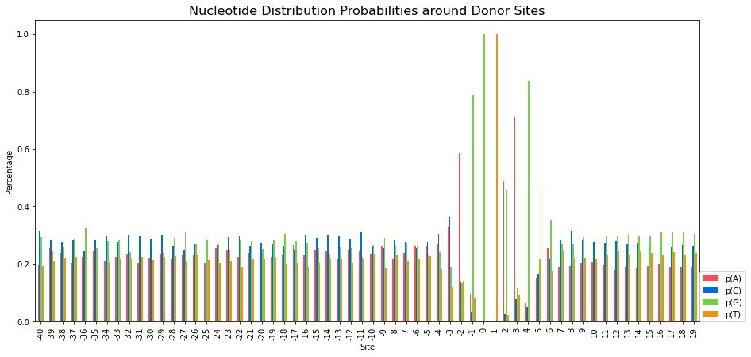
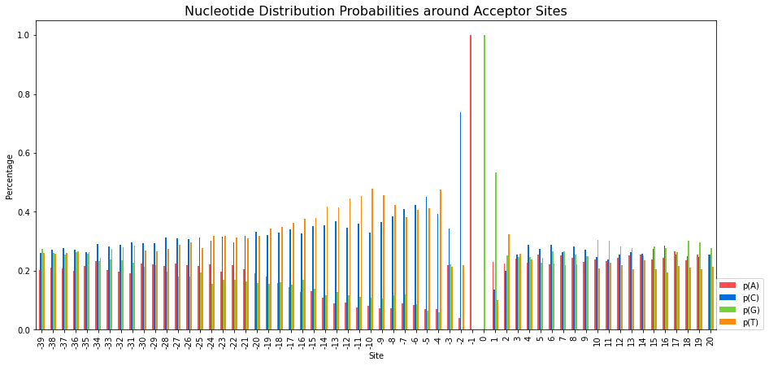
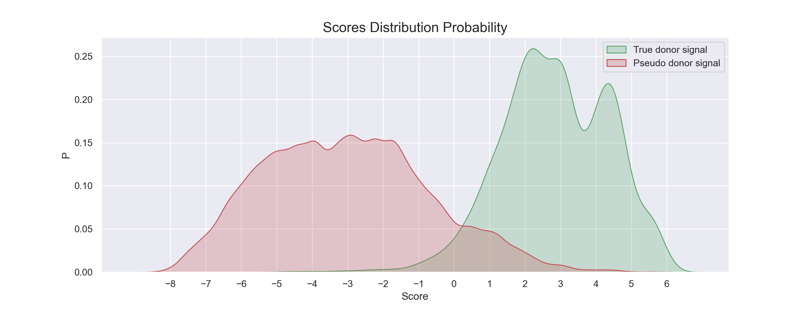
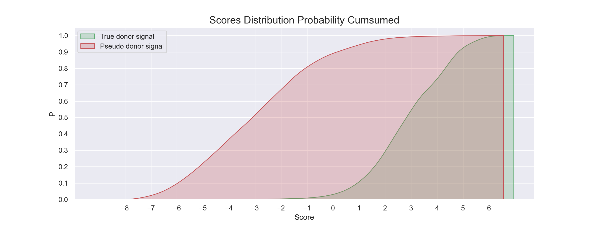
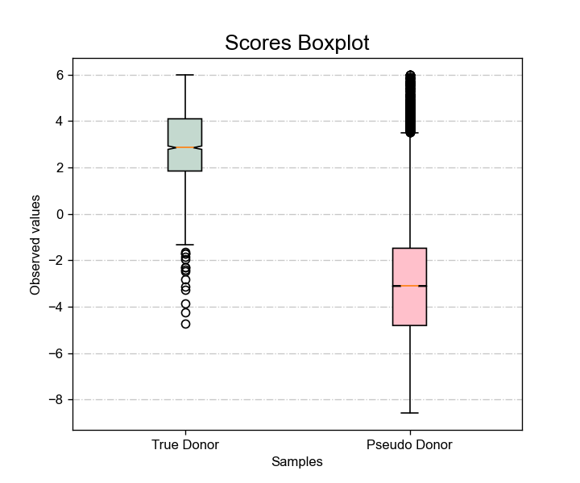
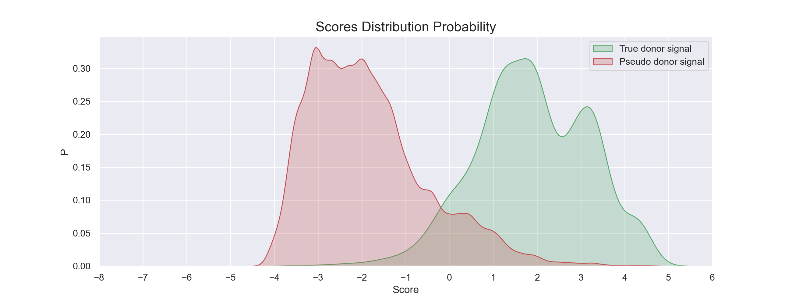

    

         
        
    

          
    
生物信息数据挖掘报告
    

  
    Prediction of Splicing Sites by WAM

     
     
	 
	 
	 
	 
 
 
 
 
 

    <table style="border:none;text-align:center;width:50%;font-family:仿宋;font-size:14px; margin: 40px 90px 0 20px;">
    <tbody style="font-family:方正公文仿宋;font-size:12pt;">
    	<tr style="font-weight:normal;"> 
    		<td style="width:20%;text-align:right;">授课教师</td>
    		<td style="width:2%">：</td> 
    		<td style="width:28%;font-weight:normal;border-bottom: 1px solid;text-align:center;font-family:华文仿宋">周艳红 </td>     </tr>
        <tr style="font-weight:normal;"> 
    		<td style="width:20%;text-align:right;">课程名字</td>
    		<td style="width:2%">：</td> 
    		<td style="width:28%;font-weight:normal;border-bottom: 1px solid;text-align:center;font-family:华文仿宋">生物信息数据挖掘</td>     </tr>
        <tr style="font-weight:normal;"> 
    		<td style="width:20%;text-align:right;">班　　级</td>
    		<td style="width:2%">：</td> 
    		<td style="width:28%;font-weight:normal;border-bottom: 1px solid;text-align:center;font-family:华文仿宋">生信基地1801</td>     </tr>
    	<tr style="font-weight:normal;"> 
    		<td style="width:20%;text-align:right;">姓　　名</td>
    		<td style="width:2%">：</td> 
    		<td style="width:28%;font-weight:normal;border-bottom: 1px solid;text-align:center;font-family:华文仿宋"> 苏济雄</td>     </tr>
    	<tr style="font-weight:normal;"> 
    		<td style="width:20%;text-align:right;">学　　号</td>
    		<td style="width:2%">：</td> 
    		<td style="width:28%;font-weight:normal;border-bottom: 1px solid;text-align:center;font-family:华文仿宋">U201812416 </td>     </tr>
	<tr style="font-weight:normal;"> 
		<td style="width:20%;text-align:right;">日　　期</td>
		<td style="width:2%">：</td> 
		<td style="width:28%;font-weight:normal;border-bottom: 1px solid;text-align:center;font-family:华文仿宋">2021.06.06</td>     </tr>
</tbody>              
</table>

<!-- 注释语句：导出PDF时会在这里分页 -->

# Prediction of Splicing Sites  by WAM

## AIM:

* 充分理解 WAM 数学原理，能够构建 WAM 模型进行 donor 位点预测；
* 学会使用编程语言提取序列数据相关信息；
* 学会模型优化以及模型预测性能评估；

## HYPOTHESIS:

真核生物的基因包含外显子和内含子，剪接时需要区分外显子和内含子，研究发现在内含子和外显子边界存在保守的剪切位点，包括内含子 5‘和3’末端序列及中间分支点（branch site）附近序列。5‘剪切点称为供体点（donor site），3’剪切点称为受体点（acceptor site）。内含子开始和末尾的碱基最为保守，为 GU-AG（约占 99.24%），少数为 GC-AG（0.7%），极少数为（AU-AC）。

内含子 donor site 和 acceptor site 上下游的碱基位点与其他位点碱基分布存在差异并假设相邻的碱基存在关联，通过碱基的分布差异可以区别真剪切位点和假剪切位点。在构建模型时，选取的 donor site 上下游序列的长度将极大影响着模型预测性能，需要选取最适长度进行模型构建。

## METHODS:

### Description of models

权重矩阵模型 WAM 是以贝叶斯公式为核心原理，考虑 donor 位点上下游相邻碱基的相关性。通过提取剪切位点上下游一定长度的信号序列，计算其频率分布，建立判别函数。通过给输入的序列打分，若分值超过设定的阈值，则预测该序列含有 donor site，反之，则判定为其他序列。

### Program design

#### 第一步：数据清洗

Training Set 文件夹有 462 个文件，每个文件对应一个基因，共 2381 个内含子，即 2381 个 donor sites 和 acceptor sites，所有文件的后缀名都是"TXT"

* 第一行如"LOCUS AB000381 35863 bp DNA PRI 14-MAY-1997"，提取的时候需要注意每条信息以多个空格分割。
* 第二行如"CDSjoin(28199..28271,28881..28988,34291..34586)"，显示外显子的位置。需要注意每个基因的第一个外显子无 acceptor site，最后一个外显子无 donor site。
* 第三行起为基因序列，以每行 60 个间隔，每个基因序列都是小写

Testing Set 文件夹有 570 个文件夹，共 2079 个内含子，该文件夹下的文件名后缀有 TXT 和 txt 混存，与 Training Set 相比有些结构区别：

* 第一行只有">"+ 基因座，如">ACU08131"
* 第二行为"> 基因座名"+ 外显子位置，如">AGGGLINE(3066..3157,3281..3503,4393..4521)"
* 第三行起为基因序列，每行 60 个，基因序列为大写。

两个文件夹内的基因序列除了 ACGT 正常碱基外，还存在未知碱基。

#### 第二步：signal 序列的提取

利用数据集中提供的 CDSjoin 提取训练集和测试集的 donor site 上下游一定长度的序列，保存为列表。

并提取训练集中在对应位置含有 GT 碱基对但不是 donor site 的序列，设为假 donor signal 序列。

#### 第三步：概率矩阵的构建

1. 碱基概率分布矩阵：分别计算 donor signal 和 pseudo donor signal 每个位置出现四种碱基 P 的概率，构建分布概率矩阵。
   $$
   P(i, x)=\frac{f(i, x)} { \sum f(i,x)}
   $$
2. 条件概率分布矩阵：考虑到碱基之间的分布不是绝对独立的，所以计算出现前一个碱基出现下一个碱基的条件概率。得到相邻碱基的条件概率分布矩阵。
   $$
   P(i,x,y)=\frac{f(i,x,y)}{f(i-1,x)}
   $$

#### 第四步：进行预测

1. 通过决策函数，先计算训练集提取出的信号序列的分值，统计正样本和负样本的分值分布情况
2. 提取测试集每个文件中的 donor 序列和假 signal 序列，放在一个文件中，donor 序列标记为 1，假 signal 序列标记为 0，给测试集每个 signal 序列打分

判别函数：

$$
S(X)=ln\frac{P^+(X)}{P^-(X)} = ln\frac{p^+(1,x_1)}{p^-(1,x_1)}+\sum_{i=2}^\lambda ln\frac{p^+(1,x_{i-1},x_i)}{p^-(1,x_{i-1},x_i)}
$$

#### 第五步：评估模型效果

根据每个序列的分值，做 ROC 和 PR 图，通过阈值的变化，查看 Recall 和 Precision 的曲线变化

常见的评估模型指标

$$
Sn/Recall = \frac{TP}{TP+FN} \\
Precision = \frac{TP}{TP+FP} \\
Sp = \frac{TN}{TN+FP} \\
FDR = 1-Sp = \frac{FP}{TN+FP} \\
Accuracy= \frac{TP+TN}{TP+TN+FN+FP} \\
F1\text{-}score =2* \frac{precision*recall}{precision+recall}
$$

## RESULTS

### 统计剪切位点上下游碱基的分布情况

为了解剪切位点上下游碱基的分布情况，统计 donor site 和 acceptor site 附近的序列共 60 个碱基，可以看到 donor site GT碱基对 下游 3个碱基和上游 4个碱基具有较强的特征性。acceptor site 则是 AG 上游有较长的连续 C/T 信号。

图1. donor site 和 acceptor site 附近的序列共 60 个碱基的weblogo图

提取donor site signal 信号的时候，先选择 donor site外显子和内含子边界 上游4 个碱基和下游 6 个碱基。

### 碱基概率分布矩阵和条件概率分布矩阵

根据提取的 signal 序列，得到碱基概率分布矩阵和条件概率分布矩阵。

从分布热图来看，可以看到 donor signal 和 common signal、pseudo donor signal 的碱基概率分布矩阵和相邻碱基条件概率矩阵存在较大差异。对于普通位点来说，每个位点的碱基分布十分相近。pseudo donor signal 除了 GT 碱基对，其他位置的碱基概率分布与 true donor signal 存在明显的区别。

    
    
    

图 2. donor site，pseudo donor site和common site的碱基分布概率矩阵

    
    
    

图 3. donor site，pseudo donor site和common site的相邻碱基条件概率矩阵

### WAM 得分情况

根据 WAM 判别函数计算提取的训练集所有 signal 序列得分，并统计其分布情况。

绿色代表 true donor signal，红色代表 pseudo donor signal，查看正样本和负样本的分值分布情况。正样本的分值绝大多数分布在 0 到 6 之间，而负样本的分值大多数分布在 0 到-8 间，但还有一部分分值高于 0。通过分值分布的累计图，可以大概估计其 recall 和 precision 值。

图 4. 训练集真样本和负样本的得分分布

图 5. 训练集真样本和负样本的得分累计分布

图 6. 训练集真样本和负样本的得分分布箱式图

### 预测及评估模型

通过调整 donor 位点上下游碱基序列长度，比较不同滑动窗口的预测性能

图7. 不同signal序列的ROC曲线

图8. 不同signal序列的ROC曲线

可以看到window=[-4,6]时，AUROC为0.97936，AUPRC为0.45304，在检测的所有signal序列长度中，性能最好。

分析window=[-4,6]时，WAM和WMM的性能差异，画 ROC 图和 PR 图，当阈值为 0.2750的时候，为 ROC 图的最佳临界点，这时 Sn-FPR 的值取最高，Recall 达到 0.96 且误判率较低，Precision 也达到 0.13，F1-score 为 0.23。WAM的ROC曲线和PR曲线都显著高于WMM模型。

    
    

图 9. window=[-4,6]时，WAM和WMM 预测性能比较

接着绘制window=[-4,6]时，各阈值下Precision、Recall和F1-score变化的趋势图。随着阈值提高，Precision先上升，但不可避免的Recall值不断下降，在阈值为5.0左右，Precision又回落。在阈值为2.7时，F1-score取得最大。F1-score是综合考虑了Precision和Recall值的指标。

图 10. window=[-4,6]时，WAM各阈值下的Precision和Recall、F1-score趋势图

表1 各阈值的预测结果

| Threshold | TP   | FP     | TN     | FN   | Recall   | Precision | F1-Score | Sn       |
| --------- | ---- | ------ | ------ | ---- | -------- | --------- | -------- | -------- |
| -9        | 2079 | 149183 | 0      | 0    | 1        | 0.013744  | 0.027116 | 0        |
| -6        | 2078 | 134741 | 14442  | 1    | 0.999519 | 0.015188  | 0.029921 | 0.096807 |
| -3        | 2077 | 72629  | 76554  | 2    | 0.999038 | 0.027802  | 0.054099 | 0.513155 |
| -1        | 2060 | 28518  | 120665 | 19   | 0.990861 | 0.067369  | 0.12616  | 0.808839 |
| 0         | 2016 | 15820  | 133363 | 63   | 0.969697 | 0.11303   | 0.20246  | 0.893956 |
| 1         | 1877 | 8166   | 141017 | 202  | 0.902838 | 0.186896  | 0.309685 | 0.945262 |
| 1.5       | 1735 | 5120   | 144063 | 344  | 0.834536 | 0.2531    | 0.388404 | 0.96568  |
| 2         | 1554 | 3069   | 146114 | 525  | 0.747475 | 0.336145  | 0.463742 | 0.979428 |
| 2.5       | 1268 | 1785   | 147398 | 811  | 0.609909 | 0.415329  | 0.494154 | 0.988035 |
| 3         | 1045 | 1126   | 148057 | 1034 | 0.502646 | 0.481345  | 0.491765 | 0.992452 |
| 3.5       | 796  | 673    | 148510 | 1283 | 0.382876 | 0.541865  | 0.448703 | 0.995489 |
| 4         | 677  | 475    | 148708 | 1402 | 0.325637 | 0.587674  | 0.419065 | 0.996816 |
| 4.5       | 371  | 230    | 148953 | 1708 | 0.178451 | 0.617304  | 0.276866 | 0.998458 |
| 5         | 154  | 69     | 149114 | 1925 | 0.074074 | 0.690583  | 0.133797 | 0.999537 |
| 5.5       | 77   | 44     | 149139 | 2002 | 0.037037 | 0.636364  | 0.07     | 0.999705 |
| 6         | 0    | 0      | 149183 | 2079 | 0        | NA        | NA       | 1        |

绘制阈值为 0.2750（ROC 最佳参数点）和阈值为 2.7（F1-score 最高点）的混淆矩阵，以比较两个最佳参数点的区别。ROC最佳参数点是真阳性率减去假阳性率最大的阈值点，代表分类模型发现正样本和负样本的总能力。如图11，可以看此时Recall=0.96, Precision=0.13, F1-score=0.23，但从混淆矩阵可知这时FP多达13415。 而F1-score是是精确率和召回率的调和平均数，认为召回率和精确率同等重要，最高点则是综合考虑Precision和Recall值，从图11右侧的混淆矩阵得知，此时Precision=0.45，Recall = 0.58，F1-score=0.51，虽然FP减少到了1498，但TP也只有1209.

    
    

图 11. 混淆矩阵：左，ROC最佳参数点的混淆矩阵；右，F1-Score最高时的混淆矩阵

### Double-WAM

之后我尝试了使用两次 WAM，尝试提高模型的预测准确度。整体策略是：

第一层 WAM 使用所有正负样本来训练模型， 将分值小于阈值的训练集中正负样本序列过滤掉。

第二层 WAM 使用所有第一层 WAM 打分分值高于阈值的样本，再次进行训练。

在对测试集进行预估的时候，也是先用第一层 WAM 进行打分，分值小于阈值的样本判定为负样本，分值高于阈值的样本再送入第二层 WAM，再次进行打分。最终设定阈值为-4 ，这样第一层就能过滤掉很大部分的负样本，同时绝大部分正样本分值都高于这个阈值。

从第二层 WAM 对训练集输入的正负样本的打分分布情况来看，正样本和负样本并不能很好区分，在-3和4分值区间内都有所重叠。虽然较于第一层WAM有所改善。

图 12. 第二层 WAM 对训练集输入的正负样本的打分分布情况

从  ROC 图和 PR 图可以得知，Double-WAM 的 ROC  和 PR 曲线都略微有点提升，说明两层的 WAM 确实能稍微提高模型预测的准确度，但效果比较有限。鉴于第二层的 WAM 依然对输入的正负样本的区分度并不好，可能需要更换其他模型来识别这些难以区分的样本。

    
    

图 13. Double-WAM的ROC和PR图

## DISCUSSION & CONCLUSION

### 模型性能

本报告通过调整 donor 位点上下游碱基序列长度，比较不同滑动窗口的预测性能，选取最佳的 signal 序列长度为[-4,6]；WAM 考虑了双碱基之间的关联，预测结果比 WMM 更好，但总体来说效果还是差强人意，Precision 最高只将近 0.7，也就是说无论如何调整阈值，预测为 donor site 的正样本中都含有很大一部分假样本，假阳性较高。最后，我还尝试使用双层 WAM 对模型进行改进，但预测结果也只有些许提升。

### 关于改进

* WAM 虽然考虑了碱基间的关联，但只考虑了相邻碱基的关联，但没有探索三个以上碱基的相互关系。可以进一步尝试更多碱基间的相互关系；
* 训练集会较大程度影响到模型性能。可以寻找其他公开的基因数据集，查看 WAM 在不同模型的预测效果；
* 从碱基序列只能获得新的生物学信息，可以利用其他生物学信息，例如利用 pre-mRNA 的结构信息来帮助预测剪接位点；
* 目前只用 WAM 预测了 donor site，可以尝试预测 acceptor site比较两者差异。

## REFERENCE

1. Steven L. Salzberg, A method for identifying splice sites and translational start sites in eukaryotic mRNA,  *Bioinformatics* , Volume 13, Issue 4, August 1997, Pages 365–376, [https://doi.org/10.1093/bioinformatics/13.4.365](https://doi.org/10.1093/bioinformatics/13.4.365)
2. M.O. Zhang, T.G. Marr, A weight array method for splicing signal analysis,  *Bioinformatics* , Volume 9, Issue 5, October 1993, Pages 499–509, [https://doi.org/10.1093/bioinformatics/9.5.499](https://doi.org/10.1093/bioinformatics/9.5.499)
3. Baten, A., Chang, B., Halgamuge, S. *et al.* Splice site identification using probabilistic parameters and SVM classification. *BMC Bioinformatics* **7,** S15 (2006). https://doi.org/10.1186/1471-2105-7-S5-S15