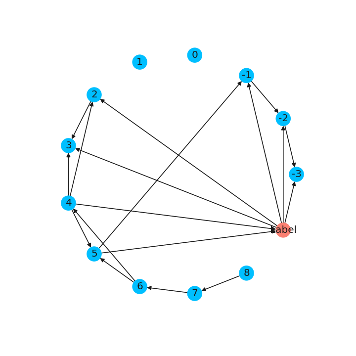
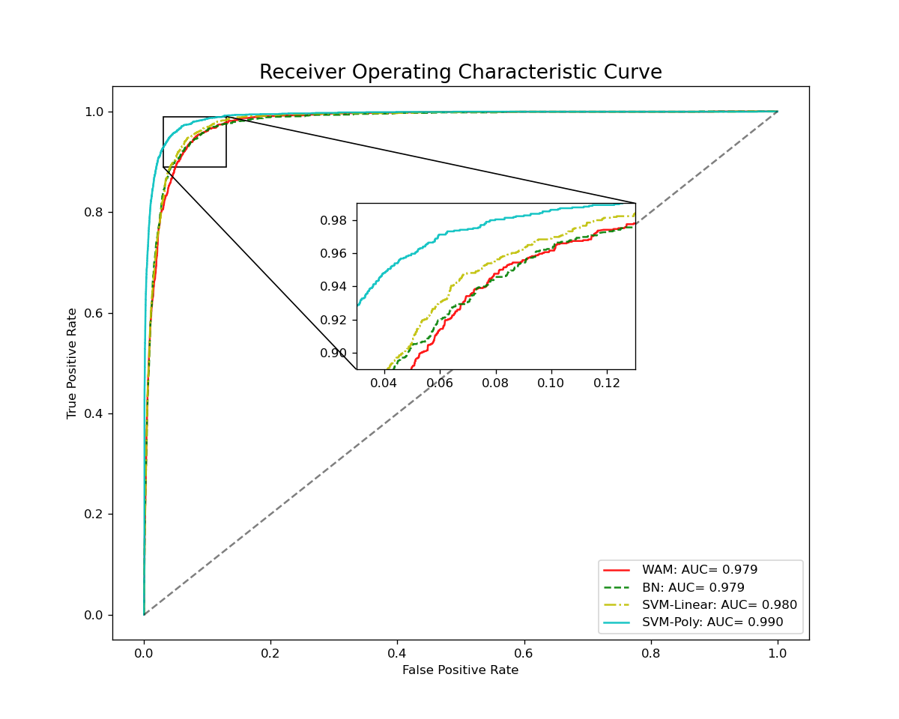
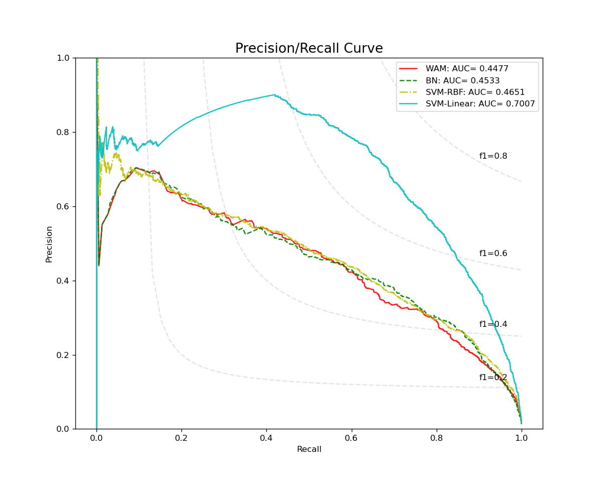
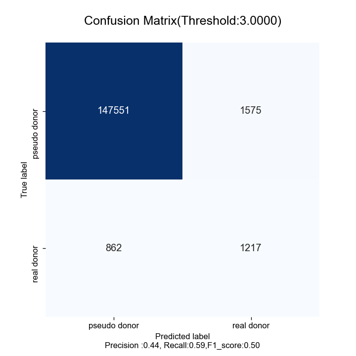
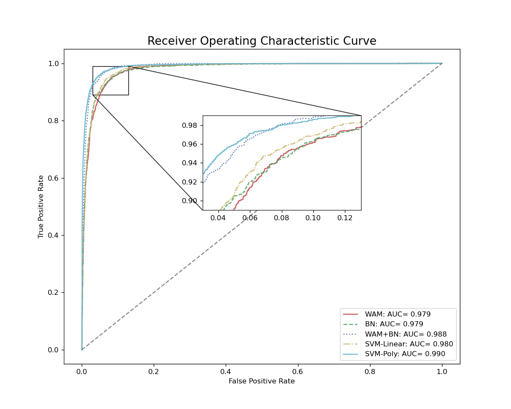
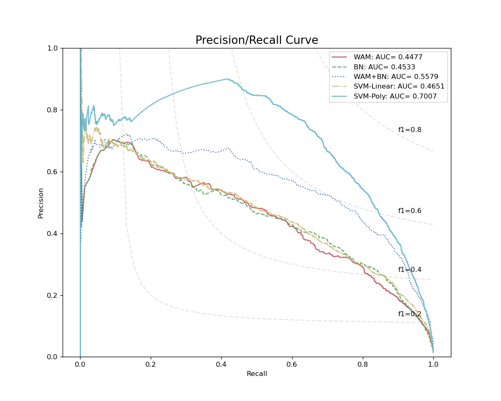
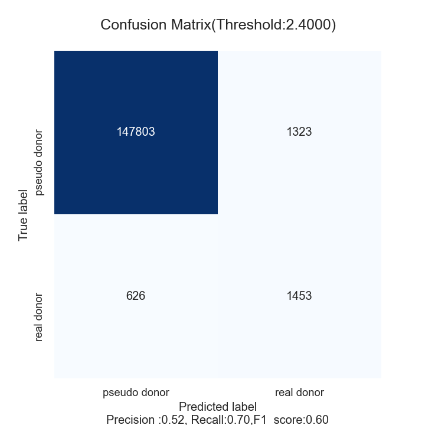
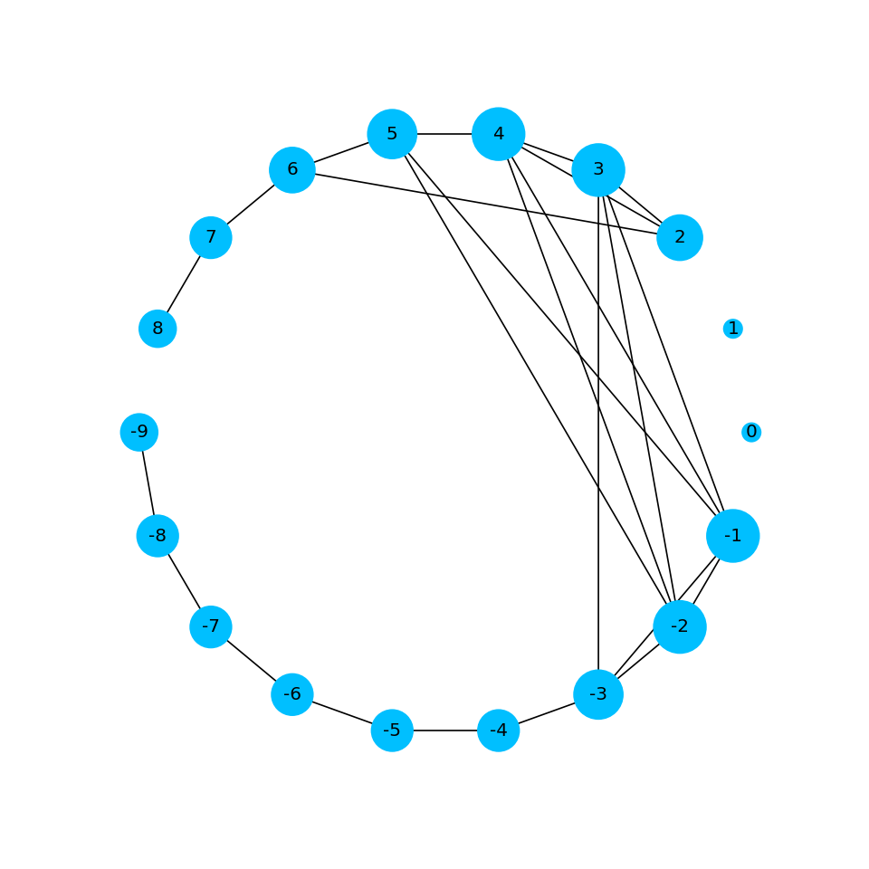
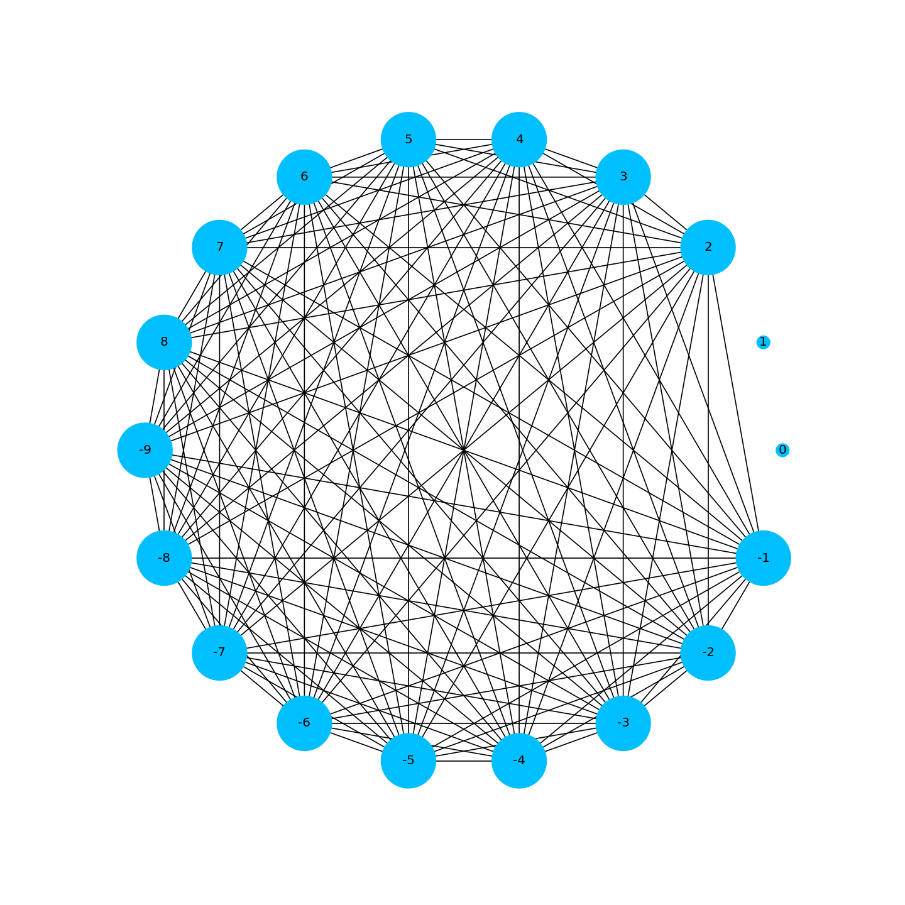

    

         
        
    

         
            
    Prediction of Splicing Sites by BN

     
     
	 
	 
	 
	 
 
 
 
 
 

    <table style="border:none;text-align:center;width:50%;font-family:仿宋;font-size:14px; margin: 40px 90px 0 20px;">
    <tbody style="font-family:方正公文仿宋;font-size:12pt;">
    	<tr style="font-weight:normal;"> 
    		<td style="width:20%;text-align:right;">授课教师</td>
    		<td style="width:2%">：</td> 
    		<td style="width:28%;font-weight:normal;border-bottom: 1px solid;text-align:center;font-family:华文仿宋">周艳红 </td>     </tr>
        <tr style="font-weight:normal;"> 
    		<td style="width:20%;text-align:right;">课程名字</td>
    		<td style="width:2%">：</td> 
    		<td style="width:28%;font-weight:normal;border-bottom: 1px solid;text-align:center;font-family:华文仿宋">生物信息数据挖掘</td>     </tr>
        <tr style="font-weight:normal;"> 
    		<td style="width:20%;text-align:right;">班　　级</td>
    		<td style="width:2%">：</td> 
    		<td style="width:28%;font-weight:normal;border-bottom: 1px solid;text-align:center;font-family:华文仿宋">生信基地1801</td>     </tr>
    	<tr style="font-weight:normal;"> 
    		<td style="width:20%;text-align:right;">姓　　名</td>
    		<td style="width:2%">：</td> 
    		<td style="width:28%;font-weight:normal;border-bottom: 1px solid;text-align:center;font-family:华文仿宋"> 苏济雄</td>     </tr>
    	<tr style="font-weight:normal;"> 
    		<td style="width:20%;text-align:right;">学　　号</td>
    		<td style="width:2%">：</td> 
    		<td style="width:28%;font-weight:normal;border-bottom: 1px solid;text-align:center;font-family:华文仿宋">U201812416 </td>     </tr>
	<tr style="font-weight:normal;"> 
		<td style="width:20%;text-align:right;">日　　期</td>
		<td style="width:2%">：</td> 
		<td style="width:28%;font-weight:normal;border-bottom: 1px solid;text-align:center;font-family:华文仿宋">2021.06.12</td>     </tr>
</tbody>              
</table>

<!-- 注释语句：导出PDF时会在这里分页 -->

# Prediction of Splicing Sites by BN

Author：Jixiong Su

<i>Huazhong University of Science and Technology</i>

<b>Abstract: </b>
 

Among the various tools in computational genetic research, gene prediction remains one of the most prominent tasks . Accurate gene prediction is of prime importance for the creation and improvement of annotations of sequenced genomes. In this paper, I have developed a model combined WAM and Bayesian Network. Compared with the exsiting model like Weight Array Model and Support Vector Machine, WAM+BN show great performance with excellent predicting accuracy and acceptable balenced time and space expenses.

<b>Key Words: </b>
 

Bayesian Network, Machine Learning, Gene Finding, Splice Sites.

<b>Availability:</b>
 

 https://github.com/Achuan-2/Splicing-Sites-Predicter

## Introduction

A gene  is a basic unit of heredity and a sequence of nucleotides in DNA or RNA that encodes the synthesis of a gene product, either RNA or protein.  Gene prediction or gene finding refers to the process of identifying the regions of genomic DNA that encode genes. This includes protein-coding genes as well as RNA genes, but may also include prediction of other functional elements such as regulatory regions. Gene finding is one of the first and most important steps in understanding the genome of a species once it has been sequenced.

In its earliest days, "gene finding" was based on painstaking experimentation on living cells and organisms. Statistical analysis of the rates of homologous recombination of several different genes could determine their order on a certain chromosome, and information from many such experiments could be combined to create a genetic map specifying the rough location of known genes relative to each other. Today, with comprehensive genome sequence and powerful computational resources at the disposal of the research community, gene finding has been redefined as a largely computational problem.

Ab Initio gene prediction is an intrinsic method based on **signal detection** and **gene content**. These signs can be broadly categorized as either signals, specific sequences that indicate the presence of a gene nearby, or content, statistical properties of the protein-coding sequence itself. Ab initio gene finding might be more accurately characterized as gene prediction, since extrinsic evidence is generally required to conclusively establish that a putative gene is functional.

In the genomes of prokaryotes, genes have specific and relatively well-understood promoter sequences (signals), such as the Pribnow box and transcription factor binding sites, which are easy to systematically identify. Also, the sequence coding for a protein occurs as one contiguous open reading frame (ORF), which is typically many hundred or thousands of base pairs long. Furthermore, protein-coding DNA has certain periodicities and other statistical properties that are easy to detect in a sequence of this length. These characteristics make prokaryotic gene finding relatively straightforward, and well-designed systems are able to achieve high levels of accuracy.

Ab initio gene finding in eukaryotes, especially complex organisms like humans, is considerably more challenging for several reasons. First, the promoter and other regulatory signals in these genomes are more complex and less well-understood than in prokaryotes, making them more difficult to reliably recognize. Second, splicing mechanisms employed by eukaryotic cells mean that a particular protein-coding sequence in the genome is divided into several parts (exons), separated by non-coding sequences (introns).  A typical protein-coding gene in humans might be divided into a dozen exons, each less than two hundred base pairs in length, and some as short as twenty to thirty. It is therefore much more difficult to detect periodicities and other known content properties of protein-coding DNA in eukaryotes.

In eukaryotic genes, splice sites mark the boundaries between exons and introns. Within introns, a donor site (5' end of the intron), a branch site (near the 3' end of the intron) and an acceptor site (3' end of the intron) are required for splicing. The splice donor site includes an almost invariant sequence GU at the 5' end of the intron, within a larger, less highly conserved region. The splice acceptor site at the 3' end of the intron terminates the intron with an almost invariant AG sequence. Upstream (5'-ward) from the AG there is a region high in pyrimidines (C and U), or polypyrimidine tract. Further upstream from the polypyrimidine tract is the branchpoint, which includes an adenine nucleotide involved in lariat formation.

In this paper, I focus on the signal related to pre-mRNA splicing, i.e. the splice sites that include donor and acceptor sites. However the occurrence of the dimer in splicing sites is not sufficient for the splice site. Indeed, it occurs very frequently at non splice site positions. So We need to construct a model  that can analyze the correlation of the bases upstream and downstream of the splicing sites to identify splicing sites. I will try to use Bayesian network to predict splicing sites, compared with other models such as WAM, SVM.

## Methods

### Bayesian Network

A Bayesian network, Bayes network, belief network, Bayes(ian) model or probabilistic directed acyclic graphical model is a probabilistic graphical model (a type of statistical model) that represents a set of random variables and their conditional dependencies via a directed acyclic graph (DAG). Bayesian networks are mostly used when we want to represent causal relationship between the random variables. Bayesian Networks are parameterized using Conditional Probability Distributions (CPD). Each node in the network is parameterized using P(node∣Pa(node)) where Pa(node) represents the parents of node in the network.

Bayesian methods provide a formalism for reasoning about partial beliefs under conditions of uncertainty. The basic expressions in Bayesian formalism are statements about conditional probabilities. We say two random variables X and Y are independent if $P(x|y)= P(x)$. The variables X and Y are conditionally independent given the random variable Z if $P(x |y, z) = P(x |z)$. From the Bayesian rule, the global joint distribution function $P(x1, x2, ..., xn) $of variables $X1, X2, ..., Xn$ can be represented as a product of local conditional distribution functions. That is,

$$
P\left(x_{1}, x_{2}, \ldots, x_{n}\right)=P\left(x_{1}\right) P\left(x_{2} \mid x_{1}\right) \cdots P\left(x_{n} \mid x_{1}, \ldots, x_{n-1}\right)
$$

A Bayesian network for a collection {X1, X2, ..., Xn} of random variables represents the joint probability distribution of these variables. The joint probability distribution, which is associated with a set of assertions of conditional independence among the variables, can be written as:

$$
P\left(x_{1}, x_{2}, \ldots, x_{n}\right)=\prod_{i=1}^{n} P\left(x_{i} \mid E_{x_{i}}\right)
$$

where $E_{x_{i}}$ is a subset of variables $x_{1}, \ldots, x_{i-1}$ on which $x_{i}$ is dependent. Hence, a Bayesian network can be described as a directed acyclic graph consisting of a set of $n$ nodes and a set of directed edges between nodes. Each node in the graph corresponds to a variable $x_{i}$ and each directed edge is constructed from a variable in $E_{x_{i}}$ to the variable $x_{i} .$ If each variable has a finite set of values, to each variable $x_{i}$ with parents in $E_{x_{i}}$, there is an attached table of conditional probabilities $P\left(x_{i} \mid E_{x_{i}}\right)$.

### Program Design

#### step 1: Feature Extraction and Encoding

Extract sequences from training set and test set and then extract  windows with fixed length that  contains a donor splice site,  excluding thewindows that contained base positions not labeled with A, T, C, G but with other symbols. Finally  encode sequences with the rule that **A is encoded for 0, G for 1, C for 2, T for 3**.

#### Step 2: Define the network structure

I use **pgmpy** for model architecture. pgmpy is a python library for working with Probabilistic Graphical Models. In pgmpy we define the network structure and the CPDs separately and then associate them with the structure. And I use the **HillClimbSearch** function to estimate the  structure, which performs local hill climb search to estimates the DAG structure that has optimal score, according to the scoring method supplied. Starts at model start_dag and proceeds by step-by-step network modifications until a local maximum is reached.

#### Step 3: Model architecture and Parameter Learning

According to a DAG and  features from training set(label positive samples as  1 and negative as 0) , build a Bayesian model and estimate the (conditional) probability distributions of the individual variables.

For model architecture, the network have **two kinds of nodes**: the feature nodes $N_i$  and label node $N_{Label}$.In the Bayesian network, each feature node has state ${Base} \in$ $\{a, c, g, t\}$ and label node has state ${Label} \in\{0,1\}$. To enable Bayesian network to learn conditional probability for all nodes , both donor sites and pseudo sites are fitted in a Bayesian network.

For parameter learning, I use **Bayesian Parameter Estimation**.The Bayesian Parameter Estimator starts with already existing prior CPDs, that express our beliefs about the variables *before* the data was observed. Those "priors" are then updated, using the state counts from the observed data.  A   sensible choice of prior is *BDeu* (Bayesian Dirichlet equivalent uniform prior). For BDeu we need to specify an equivalent sample size  N and then the pseudo-counts are the equivalent of having observed N uniform samples of each variable (and each parent configuration).

#### Step 4：Prediction and score

Input all samples from test set with missing label,  predict probabilities of label 1 and label 0. The score, $Score(S)$, of a tested potential splice site S under the two labels is the log-odds ratio defined as follows:

$$
Score(S)=\log \left[\frac{P\left(S \mid Label_{\mathrm{1}}\right)}{P\left(S \mid Label_{\mathrm{0}}\right)}\right]
$$

With an empirically determined threshold score T , the tested potential splice site S will be claimed real if the log-odds score is no less than T ; otherwise, it will be claimed pseudo.

#### Step 5: Evaluation

Compare the performance of Bayesian Network with other models such as  WAM and SVM by ROC and PR plot.

Receiver operating characteristic(ROC for short) Curve is a curve reflecting the relationship between sensitivity and specificity. The closer the ROC curve is to the upper left corner, the higher the accuracy of the test. The point closest to the top left corner of the ROC curve is the best threshold with the least errors, and the total number of false positives and false negatives is the least. AUC is the area under the ROC curve. The meaning of AUC probability is to randomly take a pair of positive and negative samples, and the probability that the score of positive samples is greater than that of negative samples. AUC is robust to the unbalanced distribution of positive and negative samples, and it is a very common measure of classifier.

Precision-Recall is a useful measure of success of prediction when the classes are very imbalanced(PR plot for short). In information retrieval, precision is a measure of result relevancy, while recall is a measure of how many truly relevant results are returned.When the distribution of positive and negative samples is unbalanced, the ROC curve remains unchanged, while the PR curve changes greatly. Compared with the ROC plot, the PR plotcan reflect the ability of the model to identify positive samples. AUROC is always going to be 0.5 — a random classifier, or a coin toss, will get you an AUROC of 0.5. But with AUPRC, the baseline is equal to the fraction of positives.

Other measures of predictive accuracy are as follows:

$$
Sn/Recall = \frac{TP}{TP+FN} \\
Precision = \frac{TP}{TP+FP} \\
F1\text{-}score =2* \frac{Precision*Recall}{Precision+Recall} \\
$$

## RESULTS

### Splice Site Datasets

The Kulp-Reese dataset is used as a training dataset, which consists of 462 non-redundant multi-exon genes, is a benchmark data set and has been widely used to train many powerful gene prediction algorithms.

The Testing set is Burset & Guigo set. The dataset assembled by Burset and Guigo(1996) consists of 570 vertebrate genomic sequences containing exaxctly multi-exon gene. There are 2079 exons and introns in the whole dataset, with more than 140000 pseudo exons and introns in the dataset. e( the testing dataset can be found at  https://genome.crg.cat/datasets/genomics96/)

### Bayesian network Results

Choose a window that contains 3 consecutive bases  upstream from the exon/intron boundary and 9 consecutive bases  downstream to the exon/intron boundary. Build a model by pgmpy. The network  obtained is shown in Figure 1.

Fig 1. The Bayesian Network Structure

Using the Bayesian network to train model, ROC and PR curves and confusion matrixes are shown in Fig 2 and Fig 3. It can be seen from ROC and PR curves that the performance of this model is ordinary. Although we consider the correlation of all bases, the performance of the model is not significantly improved compared with WAM.

    
    

Fig 2. Receiver Operating Charateristic Curve (left) and Precison/Recall Curve(right) for Bayesian Network and other models.

    
    

Fig 3. Confusion Matrix for Bayesian: The left  is under the threshold is the best parameter of ROC curve. The right is under the threshold when  F1-score is highest.

### WAM+Bayesian network

In view of the unsatisfactory effect of Bayesian network, I try to use WAM to filter out the samples with large difference between negative samples and positive samples, and then use Bayesian network to train and predict the input positive and negative samples, that is, I hope Bayesian network can separate the samples with similar scores in positive and negative samples in WAM.

During training, the positive and negative samples in the training set whose score is less than the threshold are filtered out, and then the Bayesian network is used to train with the filtered samples. In the process of prediction, WAM is used to score the samples whose score is less than the threshold value, and the samples whose score is higher than the threshold value are predicted as negative samples. Finally Bayesian network is used to predict the samples whose score is higher than the threshold value.

I set the threshold value of the first layer WAM to - 3, and the result is excellent. As can be seen from Fig 4 and Fig 5, the AUROC of WAM+BN is 0.988, close to the SVM Poly Kernel preformance. Compared with WAM and BN, the PR curve has been greatly improved, although it is worse than SVM Poly Kernel

    
    

Fig 4 Receiver Operating Charateristic Curve (left) and Precison/Recall Curve(right) for WAM+Bayesian Network and other models 

    
    

Fig 5. Confusion Matrix for WAM+Bayesian: The left  is under the threshold is the best parameter of ROC curve. The right is under the threshold when  F1-score is highest.

## DISCUSSION & CONCLUSION

In this study, I firstly use Bayesian Network to build a model to predict donor sites, in view of the effect compared with WAM, almost no improvement. So I try WAM + BN to build a two-layer model, which can be compared with SVM. At first, the effect of only using Bayesian network is poor, which may be due to the unbalanced number of positive and negative samples. Bayesian Network constructs conditional probability matrix according to the situation of samples and network structure. When the number of samples is too large, the network will be too complex and eventually the discrimination between positive and negative samples is not high. After one-layer filtering by WAM, the number of input Bayesian network samples is reduced, which reduces the time and space cost of training. The samples that the first layer of WAM can not distinguish the samples well, using more complex Bayesian network to train and predict, making the Bayesian network only for the samples that are difficult to distinguish. It has been proved that this method has greatly improved the prediction accuracy of the model.

When constructing the network structure, I tried to use contingency table to find the association of each base by $\chi^2$ test, and constructed the network  for positive and negative samples respectively. But for negative samples, I almost got a full connection diagram. In view of too many parameters, finally abandoned this method.

    
    

Fig 6. The dependency graph for the donor site and pseudo site.

## ACKNOWLEDGEMENTS

Thank Professor Yanhong Zhou for his patient guidance. The computing work in this paper is mostly  supported by the public computing service platform provided by Network and Computing Center of HUST.

## REFERENCES

1. Te-Ming Chen, Chung-Chin Lu, Wen-Hsiung Li, Prediction of splice sites with dependency graphs and their expanded bayesian networks, *Bioinformatics*, Volume 21, Issue 4, 15 February 2005, Pages 471–482, https://doi.org/10.1093/bioinformatics/bti025

2. Cai D, Delcher A, Kao B, Kasif S. Modeling splice sites with Bayes networks. Bioinformatics. 2000 Feb;16(2):152-8. doi: 10.1093/bioinformatics/16.2.152. PMID: 10842737.

3. [pgmpy -Python library for Probabilistic Graphical Models](https://github.com/pgmpy)

4. [贝叶斯网络python实战（以泰坦尼克号数据集为例，pgmpy库）_leida_wt的博客-CSDN博客_贝叶斯网络python](https://blog.csdn.net/leida_wt/article/details/88743323)

5. [BBN: Bayesian Belief Networks — How to Build Them Effectively in Python | by Saul Dobilas | Towards Data Science](https://towardsdatascience.com/bbn-bayesian-belief-networks-how-to-build-them-effectively-in-python-6b7f93435bba)

   
