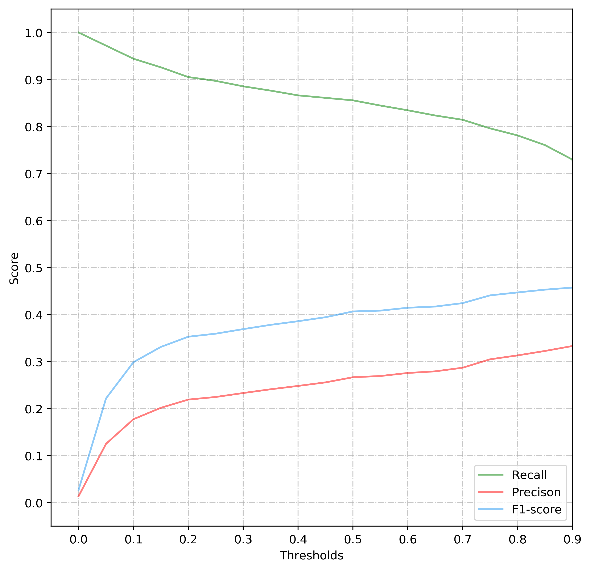

    

         
        
    

         
            
    Prediction of Splicing Sites by SVM

     
     
	 
	 
	 
	 
 
 
 
 
 

    <table style="border:none;text-align:center;width:50%;font-family:仿宋;font-size:14px; margin: 40px 90px 0 20px;">
    <tbody style="font-family:方正公文仿宋;font-size:12pt;">
    	<tr style="font-weight:normal;"> 
    		<td style="width:20%;text-align:right;">授课教师</td>
    		<td style="width:2%">：</td> 
    		<td style="width:28%;font-weight:normal;border-bottom: 1px solid;text-align:center;font-family:华文仿宋">周艳红 </td>     </tr>
        <tr style="font-weight:normal;"> 
    		<td style="width:20%;text-align:right;">课程名字</td>
    		<td style="width:2%">：</td> 
    		<td style="width:28%;font-weight:normal;border-bottom: 1px solid;text-align:center;font-family:华文仿宋">生物信息数据挖掘</td>     </tr>
        <tr style="font-weight:normal;"> 
    		<td style="width:20%;text-align:right;">班　　级</td>
    		<td style="width:2%">：</td> 
    		<td style="width:28%;font-weight:normal;border-bottom: 1px solid;text-align:center;font-family:华文仿宋">生信基地1801</td>     </tr>
    	<tr style="font-weight:normal;"> 
    		<td style="width:20%;text-align:right;">姓　　名</td>
    		<td style="width:2%">：</td> 
    		<td style="width:28%;font-weight:normal;border-bottom: 1px solid;text-align:center;font-family:华文仿宋"> 苏济雄</td>     </tr>
    	<tr style="font-weight:normal;"> 
    		<td style="width:20%;text-align:right;">学　　号</td>
    		<td style="width:2%">：</td> 
    		<td style="width:28%;font-weight:normal;border-bottom: 1px solid;text-align:center;font-family:华文仿宋">U201812416 </td>     </tr>
	<tr style="font-weight:normal;"> 
		<td style="width:20%;text-align:right;">日　　期</td>
		<td style="width:2%">：</td> 
		<td style="width:28%;font-weight:normal;border-bottom: 1px solid;text-align:center;font-family:华文仿宋">2021.06.08</td>     </tr>
</tbody>              
</table>

<!-- 注释语句：导出PDF时会在这里分页 -->

# Prediction of Splicing Sites by SVM

Author：Jixiong Su

<i>Huazhong University of Science and Technology</i>

<b>Abstract: </b>
 

In this paper, I use Support Vector Machine to predict donor site in eukaryotic genes, with One-Hot Encoding and different lengths of samples to explore different kernels of SVM. Finally the result is that SVM has the best predictive ability for sequences of 20 upstream sites and 20 downstream sites from exon/intron boundary.

<b>Key Words: </b>
 

SVM, Machine Learning, Gene Finding, Splice Site.

## AIM

* Fully understand the mathematical principle of Support Vector Machine(SVM), kernel function type and kernel parameter selection principle.
* Use SVM to predict  donor sites, using  linear, polynomial and gaussian kernels respectively.

## Background

Among the various tools in computational genetic research, gene prediction remains one of the most prominent tasks, as recent competitions have further emphasised. Accurate gene prediction is of prime importance for the creation and improvement of annotations of recently sequenced genomes . In the light of new data related to natural variation, the importance of accurate computational gene finding gains increasing importance since it helps to understand the effects of polymorphisms on the gene products.

In eukaryotic genes, splice sites mark the boundaries between exons and introns. The latter are excised from premature mRNAs in a post-processing step after transcription. Both the donor sites at the exon-intron junctions, and the acceptor sites at the intron-exon boundaries, have quite strong consensus sequences which can, however, vary significantly from one organism to another. The vast majority of all splice sites are so called canonical splice sites which are characterised by the presence of the dimers GT and AG for donor and acceptor sites, respectively. The occurrence of the dimer is not sufficient for the splice site. Indeed, it occurs very frequently at non splice site positions.

We therefore face two extremely unbalanced classification tasks, namely the discrimination between true donor sites and decoy positions with the consensus dimer GT  and the discrimination between true acceptor sites and decoy positions with the consensus dimer AG.

## METHODS:

### Description of models

Support vector machines (SVMs) are a particularly powerful and flexible class of supervised algorithms for both classification and regression.

**The advantages of support vector machines are**:

* Effective in high dimensional spaces.
* Still effective in cases where number of dimensions is greater than the number of samples.
* Uses a subset of training points in the decision function (called support vectors), so it is also memory efficient.
* Versatile: different Kernel functions can be specified for the decision function. Common kernels are provided, but it is also possible to specify custom kernels.

**The disadvantages of support vector machines include**:

* If the number of features is much greater than the number of samples, avoid over-fitting in choosing Kernel functions and regularization term is crucial.
* SVMs do not directly provide probability estimates, these are calculated using an expensive five-fold cross-validation.
* The scaling with the number of samples  N  is  O[N3]  at worst, or  O[N2]  for efficient implementations. For large numbers of training samples, this computational cost can be prohibitive.
* The results are strongly dependent on a suitable choice for the softening parameter  C . This must be carefully chosen via cross-validation, which can be expensive as datasets grow in size.

### Algorithms

**Fomula**：

$$
\begin{aligned}
\min _{\mathbf{w}, b, \xi \geq 0} & \frac{1}{2} \mathbf{w}^{\top} \mathbf{w}+C \sum_{i} \xi_{i} \\
\text { s.t. } \ & y_{i}\left(\mathbf{w}^{\top} \mathbf{x}_{i}+b\right) \geq 1-\xi_{i}, \quad i=1, \ldots, n \\
\xi_{i} \geq 0
\end{aligned}
$$

**Kernel Function**:

Kernel Function is a method used to take data as input and transform into the required form of processing data. “Kernel” is used due to set of mathematical functions used in Support Vector Machine provides the window to manipulate the data. So, Kernel Function generally transforms the training set of data so that a non-linear decision surface is able to transformed to a linear equation in a higher number of dimension spaces. Basically, It returns the inner product between two points in a standard feature dimension.

1. Linear Kernel ：
   $$
   \text { kernel }=\left\langle x, x^{\prime}\right\rangle
   $$

   It is mainly used in the case of linear separability. For general data, the classification effect is very ideal.
2. Gaussian Kernel Radial Basis Function (RBF)：
   $$
   \text { kernel }=\exp \left(-\gamma\left\|x-x^{\prime}\right\|^{2}\right)
   $$

   Radial basis function = Gaussian kernel.
   It is mainly used in the case of linear indivisibility, and the classification results are very parameter dependent.
3. Poly Kernel ：
   $$
   \text { kernel }=\left(\gamma<x, x^{\prime}>+r\right)^{d}
   $$

   It represents the similarity of vectors in training set of data in a feature space over polynomials of the original variables used in kernel.
   Parameter：
   * degree is the degree of the polynomial.
   * gamma is the coefficients of polynomial.
   * coef0  stands for r, offset the function from zero.
4. sigmoid kernel：
   this function is equivalent to a two-layer, perceptron model of neural network, which is used as activation function for artificial neurons.
   $$
   \text { kernel }=\tanh \left(\gamma<x, x^{\prime}>+r\right)
   $$

### Program design

#### Step 1: feature extraction and data coding

Data processing method：

* Extraction of donor site length: in order to evaluate the impact of sample length on prediction, different lengths of singal sequences are selected to view different prediction results.
* Base encoding: adopts one-hot coding method, set up A code for[1,0,0, 0], G for [0,1,0,0], C [0,0,1,0], T [0,0,0,1], Z (unknown base) for [0,0,0,0].
* Set negative sample: the negative sample is set to a sequence containing GT base pair but not real donor site.
* Label：Set label to 1 for positive samples and 0 for negative samples.

Data extraction results:

* Each file in the training set and test set represents an eukaryotic gene. There is at least one exon and intron in each sequence, and all sites conform to the AG-GT rule, that is, all donor sites are GT, and all acceptor sites are AG. Finally, 2381 true donor signal  sequences are extracted from 462 training dataset.
* 2079 true donor signal sequences and 149255 pseudo signals are extracted from 570 files in the test dataset.

#### Step 2: kernel function selection

The kernel functions of SVM are RBF, linear and poly. The training speed of linear is the fastest, and the effect is good in the case of linear separability. The training speed of RBF is the slowest, but it can fit better in the case of nonlinear, but it depends on parameters very much. The poly kernel is in the middle. This experiment will compare the performance of three kernel functions in the prediction of donor site.

#### Step 3: Parameter learning

Superparameters  are parameters that cannot be directly learned by the model, which need to be set manually, or be found through superparameter optimization algorithms such as Bayesian optimization or Grid Search. For example, the superparameters of SVM include regularization parameter C, kernel coefficient containing gamma, degree, class weight, cofe0, etc. When adjusting the superparameters, it might have been overfit on the test dataset, need to have a validation set so that training on the training set and evaluating on the validation set, and if it works well, you can manage the final evaluation on the test dataset. Note that when adjusting parameters, we can't use test dataset for verification, because our purpose is to apply training model to unseen data.

I finally used  k-folded cross-validation  to evaluate the training effect of the model. In the k-folded cross-validation, the data we used are all the data in the training set .Randomly divide a dataset into k groups, or “folds”, of roughly equal size. Choose one of the folds to be the holdout set. Fit the model on the remaining k-1 folds. Calculate the validation scores on the observations in the fold that was held out. Repeat this process k times, using a different set each time as the holdout set. Calculate the overall validation scores to be the average of the scores.

The function GridSearchCV is used to find the best parameters and perform 3x cross-validation simultaneously.

* C: it can adjust the extreme value of the penalty, control the size of the gap between the two lines, on behalf of the soft gap. When C is too large, the division is more strict, the generalization ability is weaker, and it is easy to over fit.
* Gamma：
  * The larger the gamma value, the higher the dimension of the mapping and the more complex the model, which may make all points become support vectors.
  * The smaller the gamma, the simpler the model.

#### Step 4: prediction and performance evaluation

Choosing the best parameters, I use three kernel functions to predict whether the sample contains donor site, and compare the performance of the three models and the difference between SVM and WAM by ROC and PR plot.

ROC curve is a curve reflecting the relationship between sensitivity and specificity. The closer the ROC curve is to the upper left corner, the higher the accuracy of the test. The point closest to the top left corner of the ROC curve is the best threshold with the least errors, and the total number of false positives and false negatives is the least. AUC is the area under the ROC curve. The meaning of AUC probability is to randomly take a pair of positive and negative samples, and the probability that the score of positive samples is greater than that of negative samples. AUC is robust to the unbalanced distribution of positive and negative samples, and it is a very common measure of classifier.

Precision-Recall is a useful measure of success of prediction when the classes are very imbalanced(PR plot for short). In information retrieval, precision is a measure of result relevancy, while recall is a measure of how many truly relevant results are returned.When the distribution of positive and negative samples is unbalanced, the ROC curve remains unchanged, while the PR curve changes greatly. Compared with the ROC plot, the PR plotcan reflect the ability of the model to identify positive samples.

## RESULTS

Fig 1.  The sequence logo.

Figure 1 shows the sequence logo of 11 upstream bases and 11 downstream bases of all donor site GT base pairs in the training dataset. A sequence logo is a graphical representation of an amino acid or nucleic acid multiple sequence alignment. Each logo consists of stacks of symbols, one stack for each position in the sequence. The overall height of the stack indicates the sequence conservation at that position, while the height of symbols within the stack indicates the relative frequency of each amino or nucleic acid at that position. In general, a sequence logo provides a richer and more precise description of, for example, a binding site, than would a consensus sequence.

From the sequence logoof all donor site GT bases for the upstream 11 bases and the downstream 11 bases, we can find that the bases at sites -3 to 5 are conservative, while the base frequencies at other sites are disordered, so I choose -3 to 5 as the signal sequence. However, considering that SVM may be able to find unknown base associations, I also choose other lengths to explore the model effect,using  SVM function in the Python Sklearn package for training and predicting.

### Window=[-3, 6]

Select a window of 9 base positions was chosen for the donor site, where 3 consecutive bases are upstream from the exon/intron boundary and 6 consecutive bases are downstream to the exon/intron boundary. A total of 283780 pseudo signal were extracted from 9 base length samples. Due to the large amount of data, 15916 pseudo signals are extracted after removing the duplication finally.

Table 1. The Paramters of Different Kernels for Sample Length = 9

| Kernel | Parameters                                     |
| ------ | ---------------------------------------------- |
| RBF    | C=0.1,gamma=1,class_weight='balanced'          |
| Linear | C=0.1,class_weight='balanced'                  |
| Poly   | C=0.1,degree=4,gamma=1,class_weight='balanced' |

Table 2. The Default Evaluation Results for Sample Length = 9

| model  | precision | recall   | f1-score |
| ------ | --------- | -------- | -------- |
| rbf    | 0.224919  | 0.896104 | 0.359583 |
| poly   | 0.190185  | 0.928331 | 0.315695 |
| linear | 0.115289  | 0.96152  | 0.205891 |

Table 1. shows the paramter selected. Table 2. shows the default evaluation results for the three models

It can be seen that the F1-score of RBF nucleus is the highest, while the recall value of linear nucleus is the highest

    
    

Fig 2. ROC plot and PR plot where 3 consecutive bases are upstream from the
exon/intron boundary and 4 consecutive bases are downstream to the exon/intron boundary

From the ROC plot, it can be seen that the AUC of RBF is the highest up to 0.9769, which is quite good, but there is not much difference between RBF and Linear, and Poly effect is not very good (maybe the parameters are not set well).

According to the PR plot, the AUC of linear kernel  is the highest, and the precision of 0.1-0.7 for Recall is higher than that of other kernels, while the precision of RBF is still good when the accuracy of 0.7-1 for Recall

I separately selecte RBF to make the tendency of Recall and Precision under different thresholds. It can be seen that the F1-score keeps rising. When the threshold is set to 0.9, the F1-score is 0.457, and the Recall is 0.730 while the Precision is 0.333, not bad.

Figure 3  The Tendency of Recall and Precision under different thresholds in  RBF kernel when sample length = 9.

### Window=[-3, 10]

Although it can be seen from the above weblogo that the information entropy after the fifth site upstream  from GT is very small,I  still hope that SVM can find the hidden information, so I try selecting the  a window of 13 base positions where 3 consecutive bases are upstream from the exon/intron  boundary and 10 consecutive bases are downstream to theexon/intron boundary.

A total of 283712 pseudo signals  are  extracted, which have little effect after de duplication, so 1 / 10 = 28371 samples are randomly extracted.

Table 3. The Paramters of Different Kernels for Sample Length = 13

| Kernel | Parameters                                         |
| ------ | -------------------------------------------------- |
| RBF    | C=1,gamma=1,class_weight='balanced'                |
| Linear | C=1,class_weight='balanced'                        |
| Poly   | C=1,degree=4,gamma='scale',class_weight='balanced' |

Table 4. The Default Evaluation Results for Sample Length = 13

| model  | precision | recall   | f1-score |
| ------ | --------- | -------- | -------- |
| rbf    | 0.709534  | 0.46176  | 0.559441 |
| poly   | 0.233561  | 0.919192 | 0.372478 |
| linear | 0.128707  | 0.9519   | 0.226755 |

    
    

Fig 4. ROC plot and PR plot where 3 consecutive bases are upstream from the
exon/intron boundary and 10 consecutive bases are downstream to the exon/intron boundary

Surprisingly, the result is  better than that of the previous 9 base samples. The AUC values of the three nucleuses are all higher than those of the previous one. On the contrary, the Poly nucleus exceeded the linear Kernel  and the RBF Kernel, and the AUC reache 0.9827.

As can be seen from the PR plot ,the curves are also significantly improved, and the AUC of RBF  reaches 0.5978. When Recall is from  0 to 0.7, Precision is significantly higher than that of the other two kernels, while Recall of the Poly kernel is from 0.8 to 1.0 , still maintains a good precison.

　　<table style="border:none;text-align:center;width:auto;margin: 0 auto;">
	<tbody>
		<tr>
			<td style="padding: 6px"></td><td></td>
		</tr>
        <tr><td>Poly Kernel</td><td>RBF Kernel</td></tr>
	</tbody>
</table>

Fig 5. The Tendency of Recall and Precision under different thresholds in Poly Kernel and RBF kernel when sample length = 13.

### Window=[-20, 20]

Select a window of 40  base positions was chosen for the donor site, where 20 consecutive bases are upstream from the exon/intron boundary and 20 consecutive bases are downstream to the exon/intron boundary for training.

Table 5. The Paramters of Different Kernels for Sample Length = 40

| Kernel | Parameters                                                   |
| ------ | ------------------------------------------------------------ |
| RBF    | C=0.1, class_weight={0: 1, 1: 100}, gamma=1, kernel': ' rbf ' |
| Linear | C=1,class_weight='balanced'                                  |
| Poly   | C=1,degree=4,gamma='scale',class_weight='balanced'           |

Table 6. The Default Evaluation Results for Sample Length = 40

| model  | precision | recall   | f1-score |
| ------ | --------- | -------- | -------- |
| rbf    | 0.300529  | 0.929774 | 0.454236 |
| poly   | 0.49357   | 0.830688 | 0.619218 |
| linear | 0.143736  | 0.955748 | 0.24989  |

The results are surprisingly good.The AUC of Poly kernel is up to 0.9903, the RBF kernel and the linear kernel are up to 0.9896 and 0.9804 respectively. The PR-AUC of Poly kernel is up to  0.7007 , while the RBF kernel is  up to 0.6665.

    
    

Fig 6. ROC plot and PR plot where 20 consecutive bases are upstream from the
exon/intron boundary and 20 consecutive bases are downstream to the exon/intron boundary

Fig 7.  The Tendency of Recall and Precision under different thresholds in Poly Kernel and RBF kernel when sample length = 40.

    
    

|

    
    

Fig 8. Confusion Matrixes under different thresholds

## DISCUSSION & CONCLUSION

In this experiment, I selected signal sequences of three kinds of lengths as samples for training, and used One-hot Coding. And I learned that SVM has the best predictive ability for sequences of 20 upstream sites and 20 downstream sites of exon/intron boundary, which hidden connections near donor site may be distinguished by SVM.

Overall predicting performance: Polynomial kernel ≈ RBF kernel >Linear kernel . Note that Polynomial kernel and RBF kernel are very parameter-dependent, so the result I get maybe not the best result.

Improvement：

* For the sample length, only three schemes are selected, and more schemes can be tried. Maybe the prediction effect of the model will be better
* Due to the high time complexity of SVM, there is not much time to search the optimal parameters, which may stimulate the real potential of the model
* Due to the excessive number of training samples, we can only adopt the method of de-duplication or random sampling, which may cause some loss of information of training samples.It may be necessary to find a suitable solution.
* Only using the BG set as testing set to view the model predictive ability, need to use more data sets to prove the model's generalization ability

## Reference

1. [ML-NLP/4. SVM.md at master · NLP-LOVE/ML-NLP (github.com)](https://github.com/NLP-LOVE/ML-NLP/blob/master/Machine%20Learning/4.%20SVM/4.%20SVM.md)
2. [05.07-Support-Vector-Machines.ipynb - Colaboratory (google.com)](https://colab.research.google.com/github/jakevdp/PythonDataScienceHandbook/blob/master/notebooks/05.07-Support-Vector-Machines.ipynb#scrollTo=kVnb5Rs3xNoT)
3. [【python 机器学习笔记】SVM 实例：有毒蘑菇预测 - 知乎 (zhihu.com)](https://zhuanlan.zhihu.com/p/73307277)
4. [四、支持向量机（SVM） - 知乎 (zhihu.com)](https://zhuanlan.zhihu.com/p/76651118)
5. [sklearn 之 SVM，ROC 曲线与 AUC 面积_WANGBINLONG-的博客-CSDN 博客](https://blog.csdn.net/weixin_45580742/article/details/104500729)
6. [Python 中的支持向量机 SVM 的使用（有实例） - 陆瑶 - 博客园 (cnblogs.com)](https://www.cnblogs.com/luyaoblog/p/6775342.html)
7. [Platt J. Probabilistic outputs for support vector machines and comparisons to regularized likelihood methods[J]. Advances in large margin classifiers, 1999, 10(3): 61-74.](https://www.researchgate.net/profile/John-Platt-2/publication/2594015_Probabilistic_Outputs_for_Support_Vector_Machines_and_Comparisons_to_Regularized_Likelihood_Methods/links/004635154cff5262d6000000/Probabilistic-Outputs-for-Support-Vector-Machines-and-Comparisons-to-Regularized-Likelihood-Methods.pdf)
8. [Cost-Sensitive SVM for Imbalanced Classification (machinelearningmastery.com)](https://machinelearningmastery.com/cost-sensitive-svm-for-imbalanced-classification/)
9. [SVM（支持向量机）—— 原理 - 知乎 (zhihu.com)](https://zhuanlan.zhihu.com/p/66885087)
10. [机器学习篇-指标：AUC - 知乎 (zhihu.com)](https://zhuanlan.zhihu.com/p/33407505)