

    

         
        
    

         
            
    Prediction of Splicing Sites 
by WAM
     
     
	 
	 
	 
	 
 
 
 
 
 

    <table style="border:none;text-align:center;width:50%;font-family:仿宋;font-size:14px; margin: 0 90px 0 20px;">
    <tbody style="font-family:方正公文仿宋;font-size:12pt;">
    	<tr style="font-weight:normal;"> 
    		<td style="width:20%;text-align:right;">授课教师</td>
    		<td style="width:2%">：</td> 
    		<td style="width:28%;font-weight:normal;border-bottom: 1px solid;text-align:center;font-family:华文仿宋">周艳红 </td>     </tr>
        <tr style="font-weight:normal;"> 
    		<td style="width:20%;text-align:right;">课程名字</td>
    		<td style="width:2%">：</td> 
    		<td style="width:28%;font-weight:normal;border-bottom: 1px solid;text-align:center;font-family:华文仿宋">生物信息数据挖掘</td>     </tr>
        <tr style="font-weight:normal;"> 
    		<td style="width:20%;text-align:right;">班　　级</td>
    		<td style="width:2%">：</td> 
    		<td style="width:28%;font-weight:normal;border-bottom: 1px solid;text-align:center;font-family:华文仿宋">生信基地1801</td>     </tr>
    	<tr style="font-weight:normal;"> 
    		<td style="width:20%;text-align:right;">姓　　名</td>
    		<td style="width:2%">：</td> 
    		<td style="width:28%;font-weight:normal;border-bottom: 1px solid;text-align:center;font-family:华文仿宋"> 苏济雄</td>     </tr>
    	<tr style="font-weight:normal;"> 
    		<td style="width:20%;text-align:right;">学　　号</td>
    		<td style="width:2%">：</td> 
    		<td style="width:28%;font-weight:normal;border-bottom: 1px solid;text-align:center;font-family:华文仿宋">U201812416 </td>     </tr>
	<tr style="font-weight:normal;"> 
		<td style="width:20%;text-align:right;">日　　期</td>
		<td style="width:2%">：</td> 
		<td style="width:28%;font-weight:normal;border-bottom: 1px solid;text-align:center;font-family:华文仿宋">2021.06.06</td>     </tr>
</tbody>              
</table>

<!-- 注释语句：导出PDF时会在这里分页 -->

# Prediction of Splicing Sites  by WAM

## AIM:

* 充分理解 WAM 数学原理，能够构建 WAM 模型进行 donor 位点预测；
* 学会使用编程语言提取序列数据相关信息；
* 学会模型优化以及模型预测性能评估；

## HYPOTHESIS:

内含子剪切需要区分外显子和内含子，主要识别包括内含子 5‘及 3’末端序列即中间分支点（branch site）附近序列。5‘剪切点称为供体点（donor site），3’剪切点称为受体点（acceptor site）。内含子开始和末尾的碱基最为保守，为 GU-AG（约占 99.24%），少数为 GC-AG（0.7%），极少数为（AU-AC）。

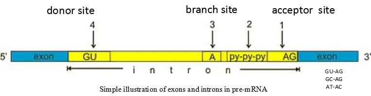

内含子 donor site 和 acceptor site 上下游的碱基位点与其他位点碱基分布存在差异，通过该差异可以区别真剪切位点和假剪切位点。而在构建模型时，选取的 donor site 上下游序列的长度将极大影响着模型预测性能，需要选取最适长度进行模型构建。

## METHODS:

### Description of models

权重矩阵模型 WAM 是以贝叶斯公式为核心原理，考虑 donor 位点上下游相邻碱基的相关性。通过提取剪切位点上下游一定长度的信号序列，计算其频率分布，建立判别函数。通过给输入的序列打分，若分值超过设定的阈值，则预测该序列含有 donor site，反之，则判定为其他序列。

### Program design

#### 第一步：数据清洗

Training Set 文件夹有 462 个文件，每个文件对应一个基因，共 2381 个内含子，即 2381 个 donor sites 和 acceptor sites，所有文件的后缀名都是"TXT"

* 第一行如"LOCUS AB000381 35863 bp DNA PRI 14-MAY-1997"，提取的时候需要注意每条信息以多个空格分割。
* 第二行如"CDSjoin(28199..28271,28881..28988,34291..34586)"，显示外显子的位置。需要注意每个基因的第一个外显子无 acceptor site，最后一个外显子无 donor site。
* 第三行起为基因序列，以每行 60 个间隔，每个基因序列都是小写

Testing Set 文件夹有 570 个文件夹，共 2079 个内含子，该文件夹下的文件名后缀有 TXT 和 txt 混存，与 Training Set 相比有些结构区别：

* 第一行只有">"+ 基因座，如">ACU08131",如果直接用 biopython 提取不太好用了
* 第二行为"> 基因座名"+ 外显子位置，如">AGGGLINE(3066..3157,3281..3503,4393..4521)"
* 第三行起为基因序列，每行 60 个，基因序列为大写。

两个文件夹内的基因序列除了 ACGT 正常碱基外，还存在未知碱基。

#### 第二步：signal 序列的提取

利用数据集中提供的 CDSjoin 提取训练集和测试集的 donor site 上下游一定长度的序列，保存为列表。

并提取训练集中在对应位置含有 GT 碱基对但不是 donor site 的序列，设为假 donor signal 序列。

#### 第三步：概率矩阵的构建

1. 碱基概率分布矩阵：分别计算 donor signal 和 pseudo donor signal 每个位置出现四种碱基 P 的概率，构建分布概率矩阵。
   $$
   P(i, x)=\frac{f(i, x)} { \sum f(i,x)}
   $$
2. 条件概率分布矩阵：考虑到碱基之间的分布不是绝对独立的，所以计算出现前一个碱基出现下一个碱基的条件概率。得到相邻碱基的条件概率分布矩阵。
   $$
   P(i,x,y)=\frac{f(i,x,y)}{f(i-1,x)}
   $$

#### 第四步：进行预测

1. 通过决策函数，先计算训练集提取出的信号序列的分值，统计正样本和负样本的分值分布情况
2. 提取测试集每个文件中的 donor 序列和假 signal 序列，放在一个文件中，donor 序列标记为 1，假 signal 序列标记为 0，运用打分公式，给测试集每个 signal 序列打分

打分公式：

$$
S(X)=ln\frac{P^+(X)}{P^-(X)} = ln\frac{p^+(1,x_1)}{p^-(1,x_1)}+\sum_{i=2}^\lambda ln\frac{p^+(1,x_{i-1},x_i)}{p^-(1,x_{i-1},x_i)}
$$

#### 第五步：评估模型效果

根据每个序列的分值，做 ROC 和 PR 图，通过阈值的变化，查看 Recall 和 Precision 的曲线变化

常见的评估模型指标

$$
Sn/Recall = \frac{TP}{TP+FN} \\
Precision = \frac{TP}{TP+FP} \\
Sp = \frac{TN}{TN+FP} \\
FDR = 1-Sp = \frac{FP}{TN+FP} \\
Accuracy= \frac{TP+TN}{TP+TN+FN+FP} \\
F1\text{-}score =2* \frac{precision*recall}{precision+recall}
$$

## RESULTS

### 统计剪切位点上下游碱基的分布情况

为了解剪切位点上下游碱基的分布情况，统计 donor site 和 acceptor site 附近的序列共 60 个碱基，可以看到 donor site GT碱基对 下游 3个碱基和上游 4个碱基具有较强的特征性。acceptor site 则是 AG 上游有较长的连续 C/T 信号。

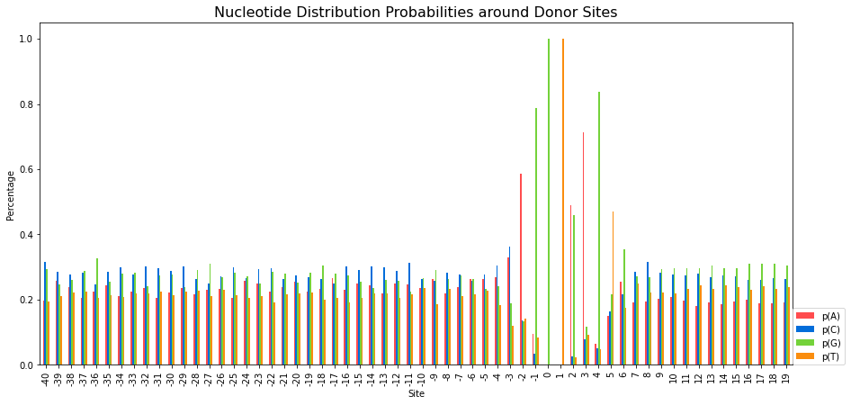

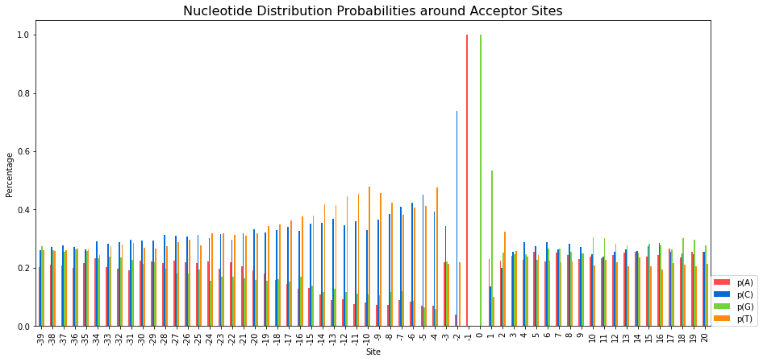

图1. donor site 和 acceptor site 附近的序列共 60 个碱基的weblogo图

提取donor site signal 信号的时候，先选择 donor site外显子和内含子边界 上游4 个碱基和下游 6 个碱基。

### 碱基概率分布矩阵和条件概率分布矩阵

根据提取的 signal 序列，得到碱基概率分布矩阵和条件概率分布矩阵。

从分布热图来看，可以看到 donor signal 和 common signal、pseudo donor signal 的碱基概率分布矩阵和相邻碱基条件概率矩阵存在较大差异。对于普通位点来说，每个位点的碱基分布十分相近。pseudo donor signa 除了 GT 碱基对，其他位置的碱基概率分布与 true donor signal 存在明显的区别。

    
    
    

图 2. donor site，pseudo donor site和common site的碱基分布概率矩阵

    
    
    

图 3. donor site，pseudo donor site和common site的相邻碱基条件概率矩阵

### WAM 得分情况

根据 WAM 判别函数计算提取的训练集所有 signal 序列得分，并统计其分布情况。

绿色代表 true donor signal，红色代表 pseudo donor signal，查看正样本和负样本的分值分布情况。正样本的分值大多数分布在 0 到 6 之间，而负样本的分值大多数分布在 0 到-8 间，但还有一部分分值高于 0。通过分值分布的累计图，可以大概估计其 recall 和 precision 值。

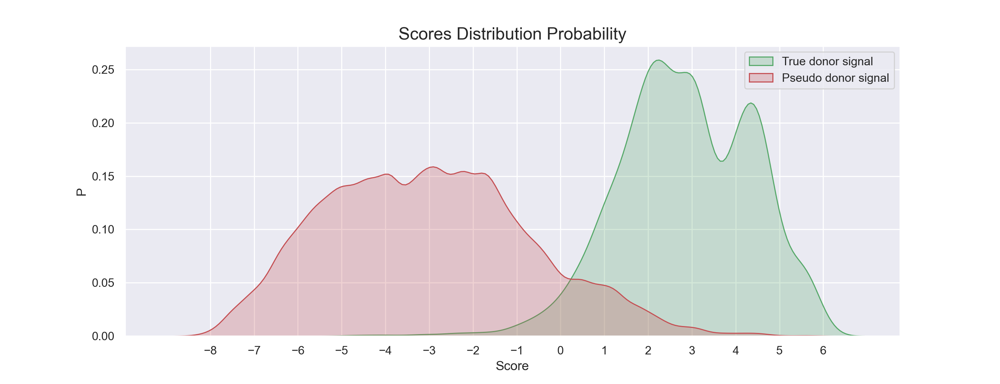

图 4. 训练集真样本和负样本的得分分布

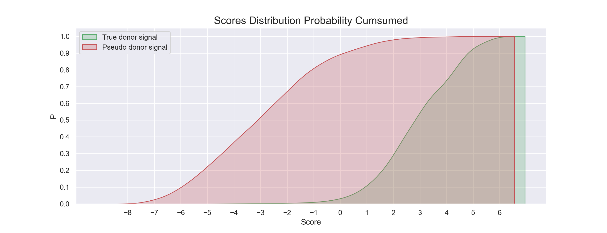

图 5. 训练集真样本和负样本的得分累计分布

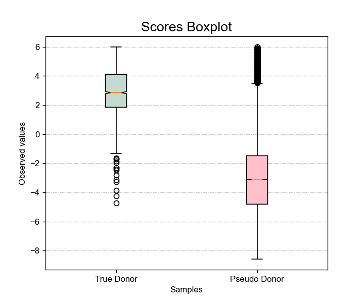

图 6. 训练集真样本和负样本的得分分布箱式图

### 预测及评估模型

通过调整 donor 位点上下游碱基序列长度，比较不同滑动窗口的预测性能

图7. 不同signal序列的ROC曲线

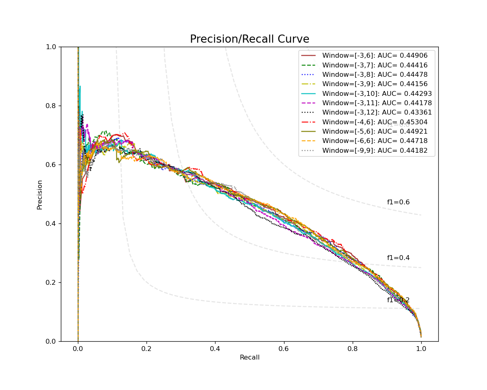

图8. 不同signal序列的ROC曲线

可以看到window=[-4,6]时，AUROC为0.97936，AUPRC为0.45304，在检测的所有signal序列长度中，性能最好。

分析window=[-4,6]时，WAM和WMM的性能差异，画 ROC 图和 PR 图，当阈值为 0.2750的时候，为 ROC 图的最佳临界点，这时 Sn-FPR 的值取最高，Recall 达到 0.96 且误判率较低，Precision 也达到 0.13，F1-score 为 0.23。WAM的ROC曲线和PR曲线都显著高于WMM模型。

    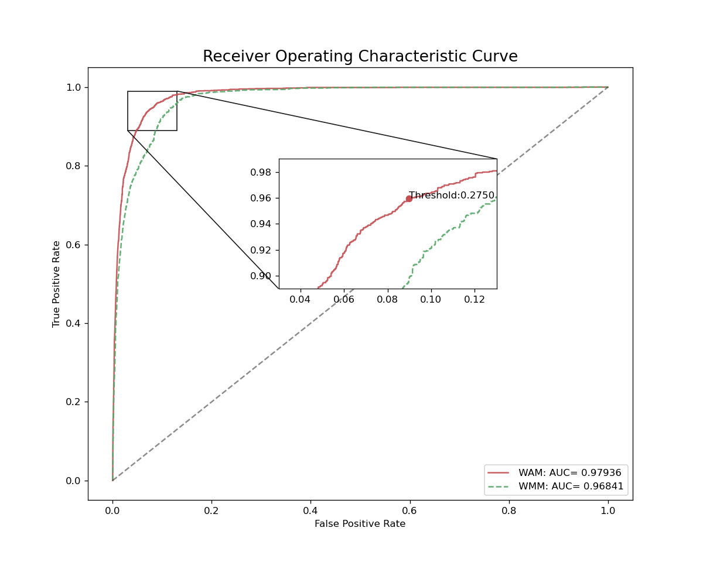
    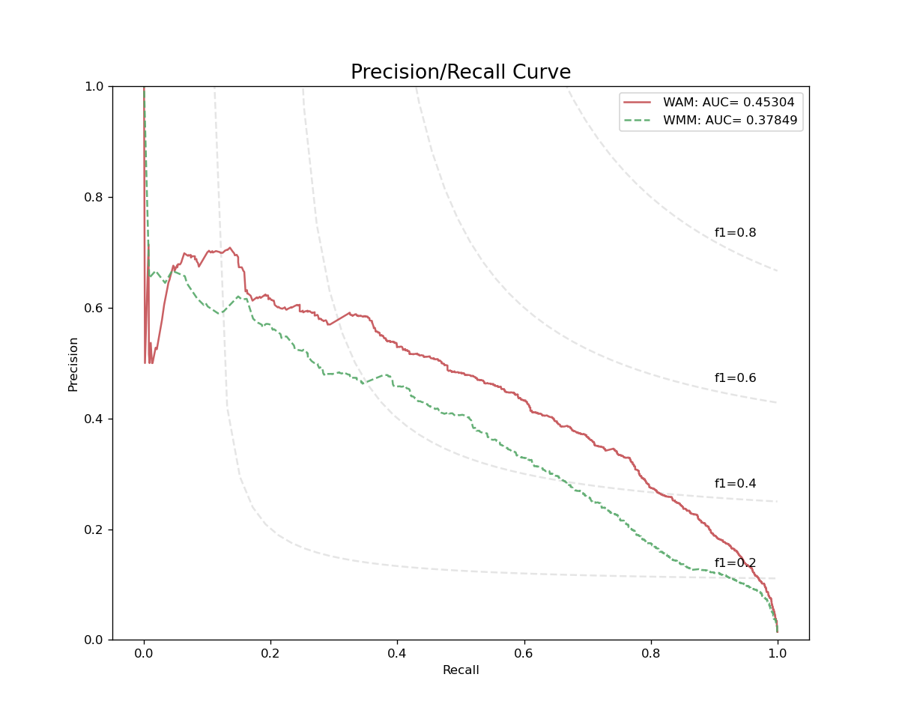

图 9. window=[-4,6]时，WAM和WMM 预测性能比较

图 10. window=[-4,6]时，WAM各阈值下的Precision和Recall、F1-score趋势图

各阈值的预测结果

| Threshold | TP   | FP     | TN     | FN   | Recall   | Precision | F1-Score | Sn       |
| --------- | ---- | ------ | ------ | ---- | -------- | --------- | -------- | -------- |
| -9        | 2079 | 149183 | 0      | 0    | 1        | 0.013744  | 0.027116 | 0        |
| -6        | 2078 | 134741 | 14442  | 1    | 0.999519 | 0.015188  | 0.029921 | 0.096807 |
| -3        | 2077 | 72629  | 76554  | 2    | 0.999038 | 0.027802  | 0.054099 | 0.513155 |
| -1        | 2060 | 28518  | 120665 | 19   | 0.990861 | 0.067369  | 0.12616  | 0.808839 |
| 0         | 2016 | 15820  | 133363 | 63   | 0.969697 | 0.11303   | 0.20246  | 0.893956 |
| 1         | 1877 | 8166   | 141017 | 202  | 0.902838 | 0.186896  | 0.309685 | 0.945262 |
| 1.5       | 1735 | 5120   | 144063 | 344  | 0.834536 | 0.2531    | 0.388404 | 0.96568  |
| 2         | 1554 | 3069   | 146114 | 525  | 0.747475 | 0.336145  | 0.463742 | 0.979428 |
| 2.5       | 1268 | 1785   | 147398 | 811  | 0.609909 | 0.415329  | 0.494154 | 0.988035 |
| 3         | 1045 | 1126   | 148057 | 1034 | 0.502646 | 0.481345  | 0.491765 | 0.992452 |
| 3.5       | 796  | 673    | 148510 | 1283 | 0.382876 | 0.541865  | 0.448703 | 0.995489 |
| 4         | 677  | 475    | 148708 | 1402 | 0.325637 | 0.587674  | 0.419065 | 0.996816 |
| 4.5       | 371  | 230    | 148953 | 1708 | 0.178451 | 0.617304  | 0.276866 | 0.998458 |
| 5         | 154  | 69     | 149114 | 1925 | 0.074074 | 0.690583  | 0.133797 | 0.999537 |
| 5.5       | 77   | 44     | 149139 | 2002 | 0.037037 | 0.636364  | 0.07     | 0.999705 |
| 6         | 0    | 0      | 149183 | 2079 | 0        | NA        | NA       | 1        |

绘制阈值为 0.2750（ROC 最佳参数点）和阈值为 2.7（F1-score 最高点）的混淆矩阵

    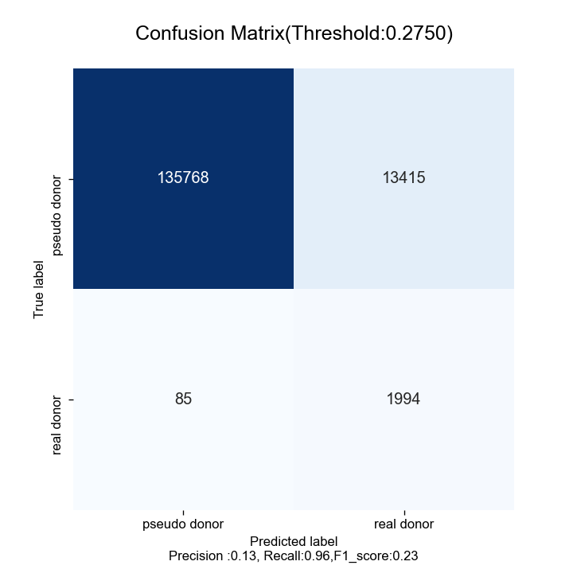
    

图 11. 混淆矩阵：左，ROC最佳参数点的混淆矩阵；右，F1-Score最高时的混淆矩阵

### Double-WAM

之后我尝试了使用两次 WAM，尝试提高模型的预测准确度。整体策略是：

第一层 WAM 使用所有正负样本来训练模型， 将分值小于阈值的训练集中正负样本序列过滤掉。

第二层 WAM 使用所有第一层 WAM 打分分值高于阈值的样本，再次进行训练。

在对测试集进行预估的时候，也是先用第一层 WAM 进行打分，分值小于阈值的样本判定为负样本，分值高于阈值的样本再送入第二层 WAM，再次进行打分。最终设定阈值为-4 ，这样第一层就能过滤掉一半的负样本，同时正样本绝大部分分值都高于这个阈值。

从第二层 WAM 对训练集输入的正负样本的打分分布情况来看，正样本和负样本并不能区分，在-3和4分值区间内都有所重叠。

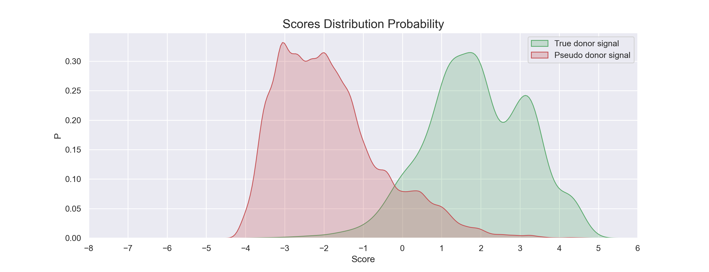

图 12. 第二层 WAM 对训练集输入的正负样本的打分分布情况

从  ROC 图和 PR 图可以得知，Double-WAM 的 ROC  和 PR 曲线都略微有点提升，说明两层的 WAM 确实能稍微提高模型预测的准确度，但效果有限。第二层的 WAM 依然对输入的正负样本的区分度并不好，可能需要更换其他模型来识别这些难以区分的样本。

    
    

图 13. Double-WAM的ROC和PR图

## DISCUSSION & CONCLUSION

### 模型性能

通过调整 donor 位点上下游碱基序列长度，比较不同滑动窗口的预测性能，选取最佳的 signal 序列长度为[-4,6]；WAM 考虑了双碱基之间的关联，预测结果比 WMM 好，但总体来说效果还是差强人意，Precision 最高只将近 0.7，也就是说无论如何调整阈值，预测为 donor site 的正样本中都含有很大一部分假样本，假阳性较高。最后，我还尝试使用双层 WAM 对模型进行改进，但预测结果只有有些许提升。

### 关于改进

* WAM 虽然考虑了碱基间的关联，但只考虑了相邻碱基的关联，但没有探索三个以上碱基的相互关系。可以进一步尝试更多碱基间的相互关系；
* 训练集会较大程度影响到模型性能。可以寻找其他公开的基因数据集，查看 WAM 在不同模型的预测效果；
* 从碱基序列只能获得新的生物学信息，例如利用 pre-mRNA 的结构信息来帮助预测剪接位点；
* 目前只用 WAM 预测了 donor site，可以尝试预测 acceptor site比较两者差异。

## REFERENCE

1. Steven L. Salzberg, A method for identifying splice sites and translational start sites in eukaryotic mRNA,  *Bioinformatics* , Volume 13, Issue 4, August 1997, Pages 365–376, [https://doi.org/10.1093/bioinformatics/13.4.365](https://doi.org/10.1093/bioinformatics/13.4.365)
2. M.O. Zhang, T.G. Marr, A weight array method for splicing signal analysis,  *Bioinformatics* , Volume 9, Issue 5, October 1993, Pages 499–509, [https://doi.org/10.1093/bioinformatics/9.5.499](https://doi.org/10.1093/bioinformatics/9.5.499)
3. Baten, A., Chang, B., Halgamuge, S. *et al.* Splice site identification using probabilistic parameters and SVM classification. *BMC Bioinformatics* **7,** S15 (2006). https://doi.org/10.1186/1471-2105-7-S5-S15